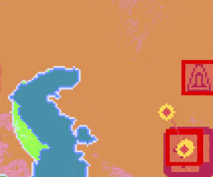
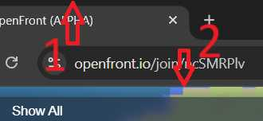
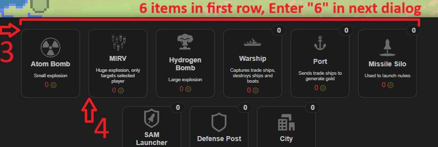

# ADDED MENU TO SELECT WHAT IS PLACABLE IN-GAME AND FACTORY

# 🌍 AutoHotkey Script for openfront.io

This AutoHotkey script helps you play [openfront.io](https://openfront.io) more efficiently by assigning keyboard shortcuts to common game actions.

**Work with all screen resolutions !**

 /

## ✅ Installation Instructions

1. Install [AutoHotkey v2.0](https://www.autohotkey.com/)
2. Openfront.ahk and config.ini must be in the same folder
3. Launch the openfront.ahk script (just double click it) 
4. Configure (see below)
5. Enjoy (sadly Chromium based browsers are better supported)

## ⚙️ Configuration

- **Calibrate** mouse position and ui size with `m` hotkey and follow the instructions.

&nbsp;
&nbsp;*click 1 then 2*

&nbsp;
&nbsp;*ctrl + click anywhere to open build menu, click 3 then 4, enter the number of elements of first row*

- Increase or decreast delay based on lag with `o` and `p` hotkeys.

- Most hotkeys can be customized in the `config.ini` file located in the same directory as the script.

- Exit Scrit and Pause/Unpause hotkeys must be set at the top of the `openfront.ahk` file :
    - `Esc:: ExitApp()`   ⇦ Edit `Esc` to Exit the script
    - `!p:: Suspend(-1)`  ⇦ Edit `!p` (alt + p) to Pause/Unpause the script

- Check [AutoHotkey key list ](https://www.autohotkey.com/docs/v2/KeyList.htm) to find valid key names and [modifier combinations](https://www.autohotkey.com/docs/v2/KeyList.htm#modifier) (like Ctrl, Alt, etc.) you can use.

## Default hotkeys
| 📜 Script                           | Key |
|------------------------------------|-----|
| ❌ Exit           | `esc` |
| ⏸️ Pause / Unpause                  | `alt + p` |

| ⚙️ Settings                           | Key |
|------------------------------------|-----|
| 📐 Calibrate mouse position           | `m` |
| ⏫ Increase delay                  | `p` |
| ⏬ Decrease delay                  | `o` |

| 🏗️ Build                   | Key |
|--------------------------|-----|
| 🏙️ Build city            | `f` |
| ⚓ Build port            | `g` |
| 🛡️ Build defense post   | `h` |
| 🚀 Build missile silo   | `j` |
| 🛡️🚀 Build SAM launcher   | `k` |

| 🚀 Send                  | Key |
|--------------------------|-----|
| 🚢 Send warship         | `r` |
| 💣 Launch atom bomb     | `t` |
| ☢️ Launch hydrogen bomb | `y` |
| 💀 Launch MIRV          | `u` |
| 🏭 Build factory        | `l` |

| 🧭 Action                   | Key |
|----------------------------|-----|
| 🚤 Naval invasion         | `x` |
| 🤝 Betray ally            | `v` |
| ℹ️ View player info       | `b` |

## ❤️ Contribute

Feel free to open an issue or pull request if you want to improve the script or report a bug!
